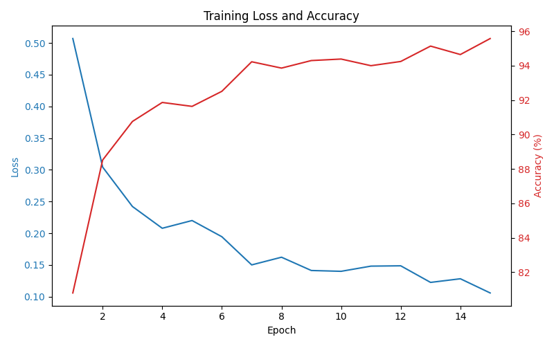
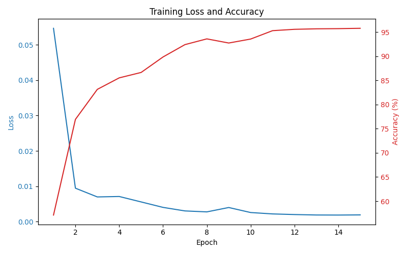

# 🧠 Brain Cancer Image Classifier

This project is a web image classification tool that allows users to upload brain MRI (Magnetic Resonance Imaging) scans and receive predictions about potential brain tumor. It supports 2 deep learning models built with **TensorFlow (MobileNetV2)** and **PyTorch  (Custom CNN)**.

## Project structure

brain_cancer_image_classifier/
│
├── data/ # Dataset files
├── models/ # Models design and training file
├── static/ # Static files (CSS, JS, images)
│ └── bootstrap/
│ └── images/
├── templates/ # HTML template (Flask)
├── utils/ # Utility script (preprocessing)
│
├── app.py # Flask app entry point
├── main.py # Model training and preprocessing scripts
├── requirements.txt # List of Python dependencies
├── jean_bayiha_model.weights.h5 # TensorFlow model
├── jean_bayiha_model.torch # PyTorch model
└── README.md # Project description

## 🧠 Model Architectures

- **TensorFlow Model**: Based on **MobileNetV2** (pretrained on ImageNet), fine-tuned with a small classification head.
- **PyTorch Model**: Custom Convolutional Neural Network trained from scratch.

## Training Accuracy and Loss



## 🚀 Getting Started

### 1. Clone the Repository

```bash
git clone https://github.com/jeanbayiha24/brain_cancer_image_classifier.git
cd brain_cancer_image_classifier
```
### 2. Create a virtual environment

### 3. Install Dependencies
```bash
pip install -r requirements.txt
```

### 4. Run the Flask App
```bash
python app.py
```
Then go to: http://127.0.0.1:5000

## Models
  - jean_bayiha_model.weights.h5: TensorFlow model (MobileNetV2)

  - jean_bayiha_model.torch: PyTorch model (custom CNN)

##👨‍💻 Author
  Jean Bayiha
  GitHub: https://github.com/JeanBayiha24
##📚 References
MobileNetV2 Paper : https://arxiv.org/pdf/1801.04381

